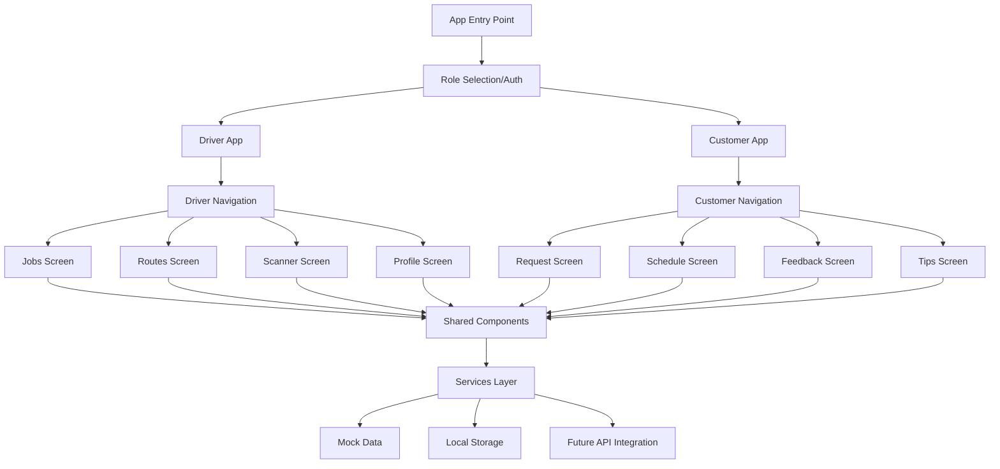

# Design Document

## Overview

The EcoTrack mobile app is a React Native application built with Expo that provides separate interfaces for waste collection drivers and business customers. The app uses a modular architecture with shared components, role-based navigation, and comprehensive offline capabilities. The design emphasizes maintainability, extensibility, and user experience optimization for mobile-first interactions.

## Architecture

### High-Level Architecture



### Technology Stack

- **Framework**: React Native with Expo SDK 49+
- **Navigation**: React Navigation v6 with bottom tabs
- **State Management**: React Context API with useReducer
- **Storage**: AsyncStorage for offline data persistence
- **Maps**: react-native-maps for route visualization
- **Camera**: expo-camera for photo capture and scanning
- **Icons**: @expo/vector-icons for consistent iconography
- **Styling**: StyleSheet with theme-based design system

### Folder Structure

```
app/
├── (tabs)/
│   ├── driver/
│   │   ├── jobs.tsx
│   │   ├── routes.tsx
│   │   ├── scanner.tsx
│   │   └── profile.tsx
│   └── customer/
│       ├── request.tsx
│       ├── schedule.tsx
│       ├── feedback.tsx
│       └── tips.tsx
├── modal.tsx
└── _layout.tsx

components/
├── ui/
│   ├── Button.tsx
│   ├── Card.tsx
│   ├── List.tsx
│   ├── Input.tsx
│   └── Modal.tsx
├── driver/
│   ├── JobCard.tsx
│   ├── RouteMap.tsx
│   └── ScannerOverlay.tsx
├── customer/
│   ├── RequestForm.tsx
│   ├── ScheduleItem.tsx
│   └── TipCard.tsx
└── shared/
    ├── Header.tsx
    ├── LoadingSpinner.tsx
    └── EmptyState.tsx

services/
├── mockData/
│   ├── driverJobs.ts
│   ├── customerData.ts
│   └── routes.ts
├── storage/
│   ├── offlineStorage.ts
│   └── cacheManager.ts
├── api/
│   └── apiService.ts (placeholder)
└── utils/
    ├── dateUtils.ts
    └── validationUtils.ts

contexts/
├── AppContext.tsx
├── DriverContext.tsx
└── CustomerContext.tsx

types/
├── driver.ts
├── customer.ts
└── common.ts

constants/
├── theme.ts
├── colors.ts
└── dimensions.ts
```

## Components and Interfaces

### Core Data Types

```typescript
// Driver Types
interface Job {
  id: string;
  customerId: string;
  address: string;
  scheduledTime: Date;
  wasteType: WasteType[];
  status: JobStatus;
  specialInstructions?: string;
  estimatedVolume: number;
  photos: string[];
  scannedCodes: string[];
}

interface Route {
  id: string;
  jobs: Job[];
  optimizedPath: Coordinate[];
  totalDistance: number;
  estimatedDuration: number;
}

// Customer Types
interface PickupRequest {
  id: string;
  customerId: string;
  wasteType: WasteType[];
  quantity: number;
  preferredDate: Date;
  isBulkDisposal: boolean;
  status: RequestStatus;
  notes?: string;
}

interface Feedback {
  id: string;
  jobId: string;
  rating: number;
  comments?: string;
  submittedAt: Date;
}

// Shared Types
enum WasteType {
  GENERAL = 'general',
  RECYCLABLE = 'recyclable',
  ORGANIC = 'organic',
  HAZARDOUS = 'hazardous'
}

enum JobStatus {
  SCHEDULED = 'scheduled',
  IN_PROGRESS = 'in_progress',
  COMPLETED = 'completed',
  CANCELLED = 'cancelled'
}
```

### Component Architecture

#### Shared UI Components

**Button Component**
```typescript
interface ButtonProps {
  title: string;
  onPress: () => void;
  variant: 'primary' | 'secondary' | 'outline';
  size: 'small' | 'medium' | 'large';
  disabled?: boolean;
  loading?: boolean;
}
```

**Card Component**
```typescript
interface CardProps {
  children: React.ReactNode;
  elevation?: number;
  padding?: number;
  onPress?: () => void;
  style?: ViewStyle;
}
```

**List Component**
```typescript
interface ListProps<T> {
  data: T[];
  renderItem: (item: T, index: number) => React.ReactNode;
  keyExtractor: (item: T) => string;
  emptyMessage?: string;
  loading?: boolean;
}
```

#### Driver-Specific Components

**JobCard Component**
- Displays job information in a card format
- Shows status indicators and priority levels
- Handles job selection and status updates
- Integrates with photo capture and scanning

**RouteMap Component**
- Renders interactive map with job markers
- Shows optimized route path
- Handles marker selection and navigation
- Supports offline map caching

**ScannerOverlay Component**
- Provides camera overlay for QR/barcode scanning
- Shows scanning guidelines and feedback
- Handles scan result processing
- Includes manual entry fallback

#### Customer-Specific Components

**RequestForm Component**
- Multi-step form for pickup requests
- Waste type selection with visual guides
- Date/time picker integration
- Form validation and submission

**ScheduleItem Component**
- Displays scheduled pickup information
- Shows countdown to pickup time
- Handles notification preferences
- Provides quick actions (reschedule, cancel)

**TipCard Component**
- Educational content display
- Image and text combination
- Category-based organization
- Interactive elements for engagement

## Data Models

### State Management Structure

```typescript
// App Context State
interface AppState {
  userRole: 'driver' | 'customer' | null;
  isOffline: boolean;
  theme: 'light' | 'dark';
  notifications: Notification[];
}

// Driver Context State
interface DriverState {
  jobs: Job[];
  currentRoute: Route | null;
  activeJob: Job | null;
  scanHistory: ScanRecord[];
  offlineQueue: OfflineAction[];
}

// Customer Context State
interface CustomerState {
  requests: PickupRequest[];
  schedule: ScheduledPickup[];
  feedbackHistory: Feedback[];
  preferences: CustomerPreferences;
}
```

### Mock Data Structure

The app will include comprehensive mock data to simulate real-world scenarios:

- **Driver Jobs**: 20+ sample jobs with varied waste types, locations, and statuses
- **Routes**: Pre-calculated optimal routes with GPS coordinates
- **Customer Requests**: Historical and pending requests with different priorities
- **Notifications**: Scheduled and real-time notification samples
- **Feedback**: Sample ratings and comments for testing

## Error Handling

### Error Categories

1. **Network Errors**: Connection timeouts, server unavailability
2. **Permission Errors**: Camera, location, storage access denied
3. **Validation Errors**: Invalid form inputs, missing required fields
4. **Storage Errors**: Local storage full, data corruption
5. **Hardware Errors**: Camera malfunction, GPS unavailable

### Error Handling Strategy

```typescript
interface ErrorHandler {
  handleNetworkError: (error: NetworkError) => void;
  handlePermissionError: (permission: Permission) => void;
  handleValidationError: (field: string, message: string) => void;
  showUserFriendlyMessage: (error: AppError) => void;
}
```

### Offline Error Handling

- Queue failed operations for retry when online
- Provide clear offline indicators
- Cache critical data for offline access
- Graceful degradation of features

## Testing Strategy

### Unit Testing

- **Components**: Test rendering, props handling, and user interactions
- **Services**: Test data processing, validation, and API calls
- **Utils**: Test utility functions and data transformations
- **Contexts**: Test state management and action dispatching

### Integration Testing

- **Navigation**: Test screen transitions and deep linking
- **Data Flow**: Test data passing between components and contexts
- **Offline Sync**: Test offline queue and synchronization
- **Camera Integration**: Test photo capture and scanning workflows

### End-to-End Testing

- **Driver Workflows**: Complete job processing from assignment to completion
- **Customer Workflows**: Request submission to feedback completion
- **Cross-Platform**: Test on both iOS and Android devices
- **Performance**: Test app performance under various conditions

### Testing Tools

- **Jest**: Unit and integration testing framework
- **React Native Testing Library**: Component testing utilities
- **Detox**: End-to-end testing for React Native
- **Flipper**: Debugging and performance monitoring

## Performance Considerations

### Optimization Strategies

1. **Image Optimization**: Compress photos before storage
2. **List Virtualization**: Use FlatList for large datasets
3. **Lazy Loading**: Load screens and components on demand
4. **Memory Management**: Proper cleanup of listeners and timers
5. **Bundle Splitting**: Separate driver and customer code bundles

### Offline Performance

- **Data Caching**: Intelligent caching of frequently accessed data
- **Background Sync**: Sync data when app is backgrounded
- **Storage Optimization**: Efficient local storage usage
- **Network Optimization**: Batch API calls and minimize requests

## Security Considerations

### Data Protection

- **Local Storage Encryption**: Encrypt sensitive data in AsyncStorage
- **Photo Security**: Secure handling of captured images
- **Input Validation**: Sanitize all user inputs
- **Permission Management**: Request minimal necessary permissions

### Future API Integration

- **Authentication**: JWT token-based authentication
- **API Security**: HTTPS only, request signing
- **Data Validation**: Server-side validation of all inputs
- **Rate Limiting**: Implement client-side rate limiting

## Accessibility

### WCAG Compliance

- **Screen Reader Support**: Proper accessibility labels and hints
- **Color Contrast**: Meet WCAG AA standards for text contrast
- **Touch Targets**: Minimum 44pt touch target size
- **Focus Management**: Logical focus order and keyboard navigation

### Inclusive Design

- **Font Scaling**: Support for dynamic font sizes
- **High Contrast**: Support for high contrast mode
- **Voice Control**: Compatible with voice control features
- **Reduced Motion**: Respect reduced motion preferences

## Future Extensibility

### Admin Portal Integration

The design includes preparation for future admin portal integration:

- **Shared Types**: Common data types for consistency
- **API Abstraction**: Service layer ready for backend integration
- **Role Management**: Extensible role-based access control
- **Data Synchronization**: Architecture supports real-time updates

### AI Feature Integration

Comments and structure prepared for future AI features:

- **Route Optimization**: AI-powered route planning
- **Waste Classification**: Image recognition for waste sorting
- **Predictive Analytics**: Usage pattern analysis
- **Smart Notifications**: AI-driven notification timing

### Scalability Considerations

- **Modular Architecture**: Easy to add new features and screens
- **Component Library**: Reusable components for rapid development
- **State Management**: Scalable context-based state management
- **Code Organization**: Clear separation of concerns for team development